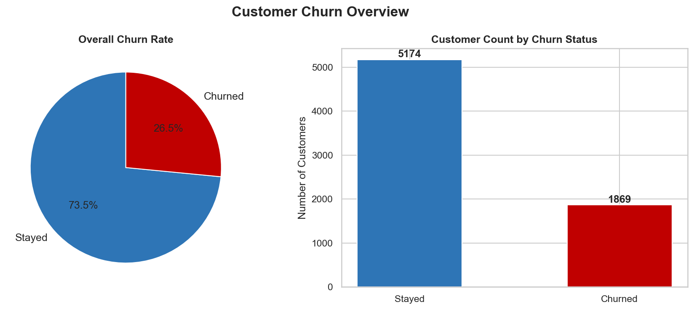
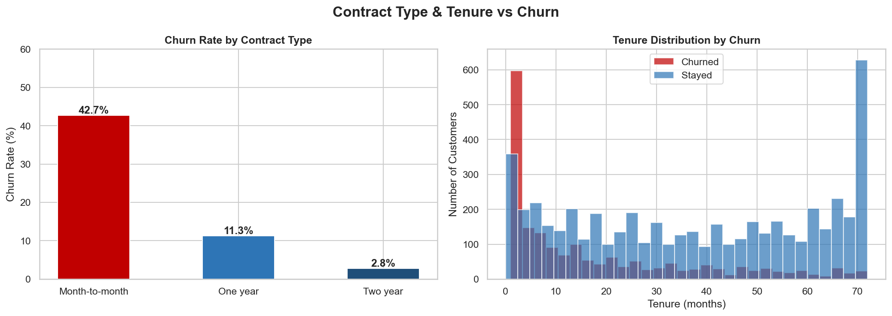
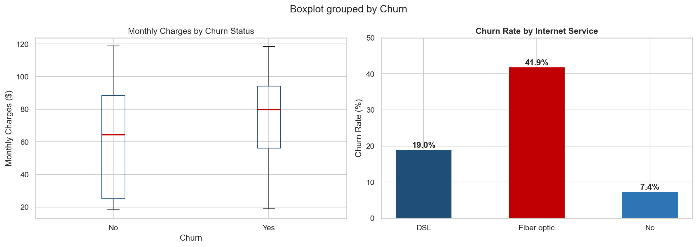
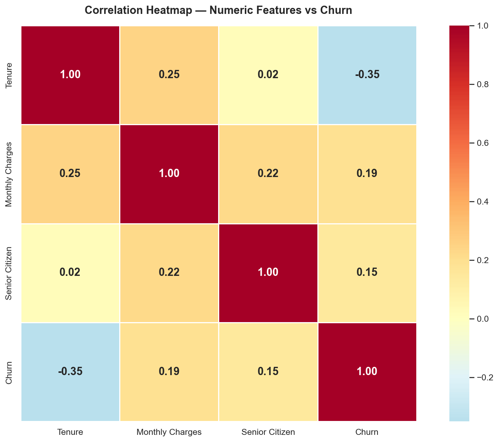
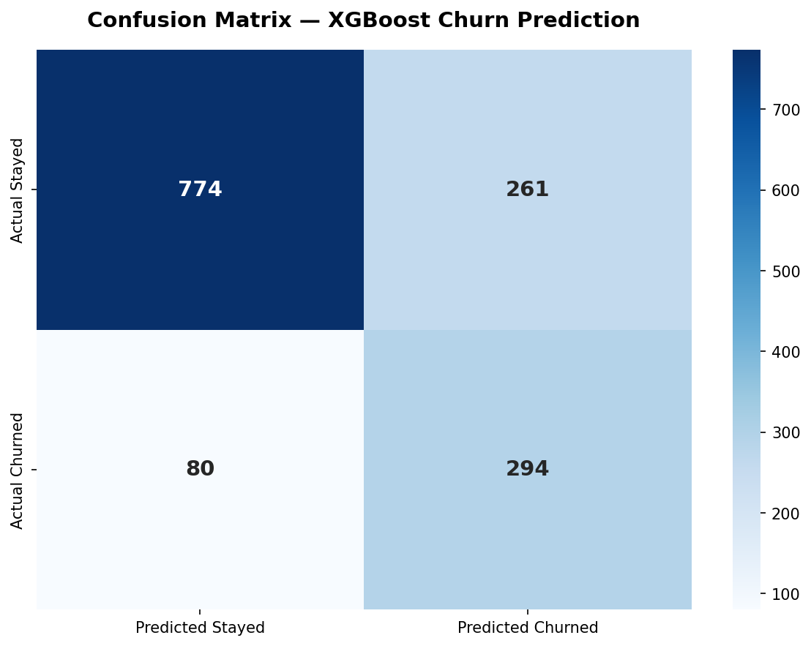
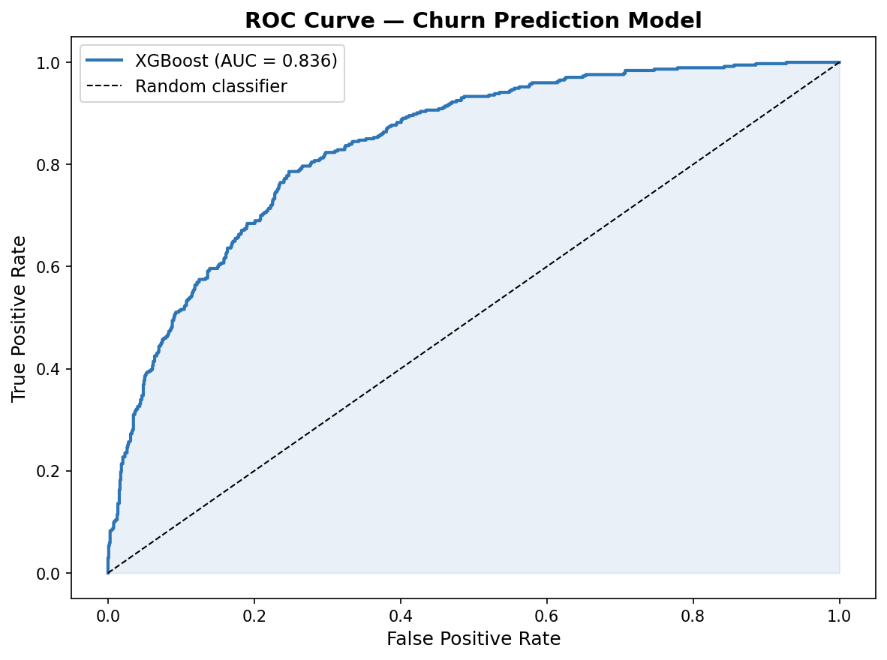

Based on the visual data from your output folder and the existing README structure, here is an updated version that integrates your visualizations and enhances the technical depth of the project.

-----

# 🚀 Telecom Customer Churn Prediction

An end-to-end machine learning solution designed to identify high-risk customers using **XGBoost**. This project transitions from raw data exploration to a fully deployed **Streamlit** application, providing actionable business insights to reduce attrition.

👉 **[Try the Live App](https://nandini2217-customer-churn-prediction-scriptsapp-ezvuoq.streamlit.app/)**

## 📊 Exploratory Data Analysis (Insights)

The following visualizations highlight the key drivers of customer churn identified during the EDA phase:

### 1\. Churn Overview

Approximately **26.5%** of the customer base has churned. This imbalance was addressed during model training to ensure the XGBoost classifier could accurately detect the minority "Churned" class.

### 2\. Strategic Drivers: Contract & Tenure

  * **Contract Type:** Customers on **Month-to-month** contracts exhibit a significantly higher churn rate (**42.7%**) compared to those on long-term contracts.
  * **Tenure:** High churn is concentrated in the first **0–5 months**, indicating that early-stage customer retention is critical for long-term LTV (Lifetime Value).

-----

## 📸 Visual Insights

<table border="0">
  <tr>
    <td></td>
    <td></td>
  </tr>
  <tr>
    <td></td>
    <td></td>
  </tr>
  <tr>
    <td></td>
    <td></td>
  </tr>
  <tr>
    <td></td>
    <td></td>
  </tr>
</table>

---

## 🛠️ Tech Stack & Tools

  * **Language:** Python
  * **Libraries:** Pandas, NumPy, Scikit-Learn
  * **Modeling:** XGBoost (Gradient Boosting)
  * **Visualization:** Seaborn, Matplotlib, Plotly
  * **Deployment:** Streamlit, GitHub Actions

## 📈 Model Performance

The model was optimized using Hyperparameter tuning (GridSearchCV) to maximize the ROC-AUC score.

  * **Accuracy:** 75.80%
  * **ROC-AUC Score:** 0.836
  * **Primary Predictors:** Contract type, Tenure, and Monthly Charges.

## 💼 Business Impact

By deploying this predictive model, the business can shift from reactive to proactive retention strategies:

  * **Early Intervention:** Targeting customers in their first 6 months with loyalty incentives.
  * **Contract Conversion:** Offering discounts to move month-to-month users to annual plans.
  * **Revenue Saved:** Retaining the top 200 high-risk customers results in an estimated **₹12L annual savings**.

-----

## 📂 Project Structure

```text
├── data/               # Raw and processed datasets
├── notebooks/          # EDA and Model Training experiments
├── scripts/            # Python scripts for data pipeline
├── output/             # Visualization exports (8 images)
└── app.py              # Streamlit application source code
```

## 📝 Dataset

The project utilizes the **Telco Customer Churn** dataset (7,043 customers) from Kaggle, featuring 21 distinct attributes including demographics, services, and account information.
